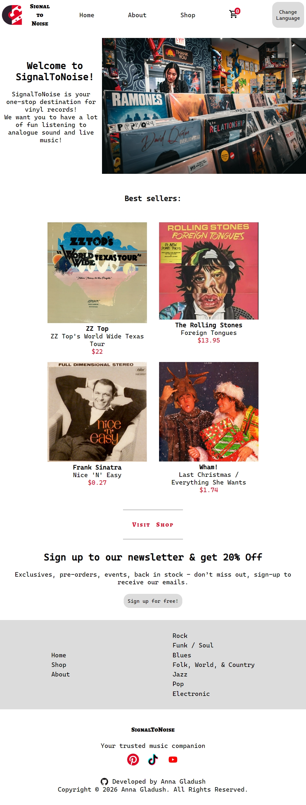

# Shopping Cart

A simple vinyl shop.

## Technologies

<ul>
  <li><code>TypeScript</code></li>
  <li><code>React</code></li>
  <li><code>React Router</code></li>
  <li><code>React Testing Library</code></li>
  <li><code>i18next</code></li>

</ul>

## How to improve?

- known issue: doesn't correctly search in russian categories.
- add cds and other media...
- react testing
- add strype ?

## What I Learned

How to use React Testing, React Router, Context API, as well as how to use Github Action (CI/CD)

## Running the project

Clone the repository <code>git clone https://github.com/Anna-Gladush/Project-Shopping-Cart.git</code>

Install the packages using the command <code>npm install</code>

Run <code>npm run dev</code>

## Live Preview

<table>
<tr>
  <th>Mobile</th>
  <th>Tablet</th>
  <th>Desktop</th>
</tr>
<tr>
  <td></td>
  <td></td>
  <td></td>
</tr>
</table>

## Resources

<ul>
  <li>icons: <a href="https://devicon.dev">Devicon</a></li>
  <li>images: Photo by <a href="https://unsplash.com/@jossbroward?utm_source=unsplash&utm_medium=referral&utm_content=creditCopyText">Joss Broward</a> on <a href="https://unsplash.com/photos/a-woman-standing-in-front-of-a-display-of-records-ItgwitBR4no?utm_source=unsplash&utm_medium=referral&utm_content=creditCopyText">Unsplash</a>, Photo by <a href="https://unsplash.com/@abbycat?utm_source=unsplash&utm_medium=referral&utm_content=creditCopyText">Natalia Bazyl</a> on <a href="https://unsplash.com/photos/display-of-vinyl-records-for-sale-in-a-store-FqD9dZn9oeU?utm_source=unsplash&utm_medium=referral&utm_content=creditCopyText">Unsplash</a> and on <a href="https://unsplash.com/photos/record-albums-displayed-on-shelves-in-a-store--QHpWfg-C8c?utm_source=unsplash&utm_medium=referral&utm_content=creditCopyText">Unsplash</a></li>
  <li>fonts: Alegreya SC and Cascadia Mono from Google Fonts</a>
</ul>
<!-- discojs -->
